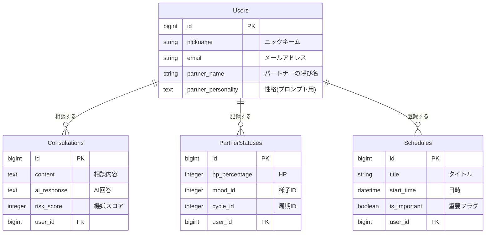
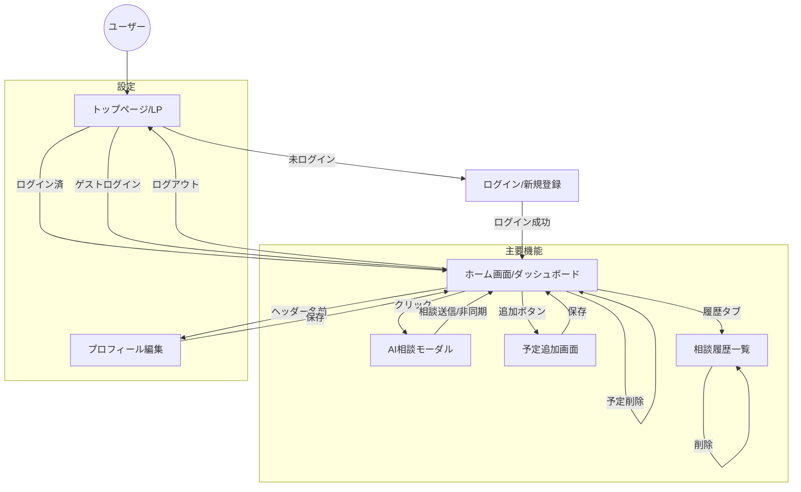

# Meoto-Log（メオトログ）
～「妻の機嫌」を論理的に攻略し、家庭の平和を守るAIパートナー～

## 1. アプリケーション概要
**「妻の機嫌を論理的に攻略したい」**
そんな夫のための、夫婦仲改善・客観視アプリケーションです。
日々の言動に対するAIからの客観的なフィードバック（ご機嫌度採点）と、パートナーのコンディション（HP・体調周期）の可視化により、忙しい育児中などでも感情的なすれ違いを防ぎ、円満な家庭維持をサポートします。

---

## 2. 作成した背景（Why）
第一子誕生を控え、自分自身の妻への理解不足や、環境変化による「産後クライシス」のリスクを痛感しました。
「良かれと思ってやったことで怒らせてしまう」「何が悪いのか自分では気づけない」という課題に対し、個人の意識改革には限界があると感じました。
そこで、**AIという「有能な第三者」の視点**を取り入れることで、感情論ではなく論理的に状況を分析し、継続的に関係を改善できる仕組みを作りたいと考え、開発に至りました。

---

## 3. URL
**[https://meoto-log.onrender.com](https://meoto-log.onrender.com)**

> **⚠️ Basic認証を導入しています**
> *   **ID:** `meoto`
> *   **Pass:** `1122`
> 
> （**ゲストログイン機能**を実装しています。ログイン画面の「ゲストログイン」ボタンから、ワンクリックで全機能を試用可能です）

---

## 4. 主な機能

### 🤖 1. AI相談機能（心臓部）

*   **コンテキストを考慮したAI:** 単なるチャットボットではなく、「パートナーの性格（せっかち、共感重視など）」や「現在の体調周期（イライラ期など）」のデータをプロンプトに組み込むことで、**その時々の状況に最適化されたアドバイス**を生成します。
*   **ご機嫌度スコアリング:** 相談内容からリスクを分析し、妻の機嫌を0〜100点で定量化（採点）します。
*   **LINE風チャットUI:** ボトムナビから即座に起動でき、日常的に使いやすいUIを採用しました。

### 📊 2. ダッシュボード（コンディション可視化）

*   **妻のHP可視化:** AIの判定結果や時間経過に応じて変動する「HPバー」を実装。ひと目で「今はそっとしておくべきか、話しかけても良いか」を判断できます。
*   **イベント管理:** 「これからの予定」と「絶対に忘れてはいけない記念日」を分けて表示し、うっかり忘れによるトラブルを未然に防ぎます。

### 📝 3. ログ管理・振り返り
*   **アコーディオンUI:** 過去の相談履歴をスッキリと一覧表示。
*   **ナレッジ蓄積:** AIからの回答だけでなく、詳細な「解説（なぜその回答が良いのか）」も保存・閲覧可能にし、ユーザー自身の学習を促します。

---

## 5. 技術的なこだわり・工夫（Tech）

### 🔋 リアリティを追求した「HP自動算出ロジック」
ただの数値管理ではなく、ユーザーが納得感を持てる「生きた数値」にするため、独自の計算ロジックを実装しました。
*   **複合的な減算処理:** 「AIによる機嫌スコア」×「時間経過（朝〜夜の疲労蓄積）」×「体調周期係数」を掛け合わせ、リアルタイムに近いHPを算出。
*   **ActiveHashの活用:** 体調周期などの静的なマスターデータにはActiveHashを採用し、DB負荷を軽減しつつ保守性を高めました。

### 🔄 非同期通信によるUX向上（Ajax）
「相談してすぐに結果を知りたい」というユーザー心理に応えるため、JavaScript(Stimulus)を用いた非同期処理を徹底しました。
*   **即時反映:** 相談送信後、リロードなしでHPバーやログ一覧が更新されます。
*   **モーダル制御:** ユーザーがAIのアドバイスを読み終えてモーダルを閉じたタイミングで画面更新イベントを発火させるなど、体験を阻害しない挙動にこだわりました。

### 🤝 初見ユーザーへの配慮（ゲスト機能の強化）
ポートフォリオとしての閲覧しやすさを最優先に設計しました。
*   **データのリセット:** `SecureRandom`を用いてゲストごとにユニークな一時アカウントを発行・削除する仕組みを構築し、データ競合を防いでいます。
*   **エッジケース対応:** データが空の状態（初回ログイン時）でもレイアウト崩れが起きないよう、View側で条件分岐によるハンドリングを行いました。

---

## 6. 使用技術（Environment）

*   **Backend:** Ruby 3.2 / Ruby on Rails 7.0
*   **Frontend:** HTML / CSS (Tailwind CSS) / JavaScript (Stimulus)
*   **Database:** PostgreSQL
*   **Infrastructure:** Render
*   **API:** OpenAI API (gpt-3.5-turbo / gpt-4o-mini)
*   **Tools:** Docker / Git / GitHub / VScode

---

## 7. データベース設計（ER図）

情報の整合性を重視し、正規化を徹底しました。特に「ユーザー（夫）」と「パートナー（妻）」の情報を同一テーブルに混ぜず、状態管理（PartnerStatuses）を切り出すことで、将来的な機能拡張（パートナー側からのログイン機能など）にも耐えうる設計を意識しました。

## 8. 画面遷移図
