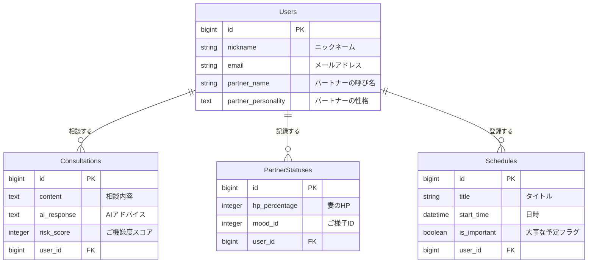
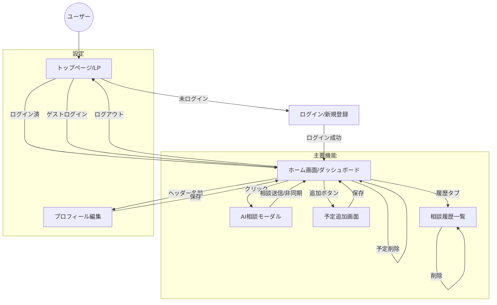

# Meoto-Log（メオトログ）

## 1. アプリケーション概要
「妻の機嫌を論理的に攻略したい」夫のための、夫婦仲改善・客観視アプリ。
日々の言動に対するAIからの客観的なフィードバック（ご機嫌度採点）と、妻のコンディションの可視化により、忙しい育児中などでもすれ違いを防ぎ、円満な家庭を維持します。

## 2. 作成した背景
第一子誕生を前に、自分自身の妻への理解不足や、環境変化による夫婦仲悪化のリスクを痛感しました。
「良かれと思ってやったことで妻を怒らせてしまう」「何が悪いのか自分では気づけない」という課題に対し、個人の意識改革だけでなく、AIという「有能な第三者」の視点を取り入れることで、論理的かつ継続的に関係を改善したいと考え、開発に至りました。

## 3. URL
[https://meoto-log.onrender.com]

## 4. 主な機能
### 🤖 AI相談機能（心臓部）
- **LINE風チャットUI**: いつでもどこでも、ボトムナビから即座にAIに相談可能。
- **ご機嫌度スコアリング**: 自分の発言が妻の機嫌をどうさせるか、0〜100点で採点。
- **パートナー性格設定**: 「せっかち」「共感重視」など、パートナーの性格を登録することで、AIのアドバイスがパーソナライズされます。

### 📊 ダッシュボード（ホーム画面）
- **妻のHP可視化**: 現在の体力を数値化し、ひと目でコンディションを判断。
- **予定管理**: 「今日の予定」と「大事な日（記念日など）」を分けて表示し、うっかり忘れを防止。
- **直近ログ**: 相談した結果をホーム画面で即座に確認可能。

### 📝 ログ管理
- **アコーディオンUI**: 過去の相談履歴を一覧表示し、タップで詳細を展開。
- **フィルタリング**: スコアに応じて色分け（青：良好、赤：危険）され、直感的に振り返りが可能。

### ⚡️ ユーザー体験（UX）向上
- **ゲストログイン機能**: メールアドレス登録なしで、ワンクリックで即座にアプリの全機能を試用可能。
  （※試用しやすくするため、ゲストログインをするたびにデータは初期状態にリセットされます）
- **レスポンシブ対応**: スマートフォンでの操作に最適化し、アプリライクなUIを実現。
- **PWA対応**: ホーム画面にアイコンを追加可能（iOS/Android）。

## 5. 使用技術
- **Backend**: Ruby 3.2 / Ruby on Rails 7.0
- **Frontend**: HTML / CSS (Tailwind CSS) / JavaScript (Stimulus)
- **Database**: PostgreSQL
- **Infrastructure**: Render
- **API**: OpenAI API (gpt-3.5-turbo / gpt-4o-mini)
- **Tools**: Docker / Git / GitHub

## 6. データベース設計
### Users テーブル
ユーザー（夫）の情報を管理。パートナーの性格や呼び名も保存。
| Column              | Type   | Options     | Note                               |
| ------------------- | ------ | ----------- | ---------------------------------- |
| nickname            | string | null: false | ニックネーム                       |
| email               | string | null: false | メールアドレス                     |
| password            | string | null: false | パスワード                         |
| partner_name        | string |             | パートナーの呼び名                 |
| partner_personality | text   |             | パートナーの性格（AIプロンプト用） |

### Consultations テーブル
AIへの相談内容とフィードバックを保存。
| Column      | Type       | Options     | Note               |
| ----------- | ---------- | ----------- | ------------------ |
| content     | text       | null: false | 相談内容           |
| ai_response | text       | null: false | AIからのアドバイス |
| risk_score  | integer    | null: false | ご機嫌度スコア     |
| user        | references | null: false | 外部キー           |

### Partner_Statuses テーブル
妻のHPや機嫌の状態を記録。
| Column        | Type       | Options     | Note                 |
| ------------- | ---------- | ----------- | -------------------- |
| hp_percentage | integer    | null: false | HP(0-100)            |
| mood_id       | integer    | null: false | ご様子ID(ActiveHash) |
| user          | references | null: false | 外部キー             |

### Schedules テーブル
予定を管理。
| Column       | Type       | Options        | Note             |
| ------------ | ---------- | -------------- | ---------------- |
| title        | string     | null: false    | 予定タイトル     |
| start_time   | datetime   | null: false    | 日時             |
| is_important | boolean    | default: false | 大事な予定フラグ |
| user         | references | null: false    | 外部キー         |

## 7. ER図

## 8. 画面遷移図
