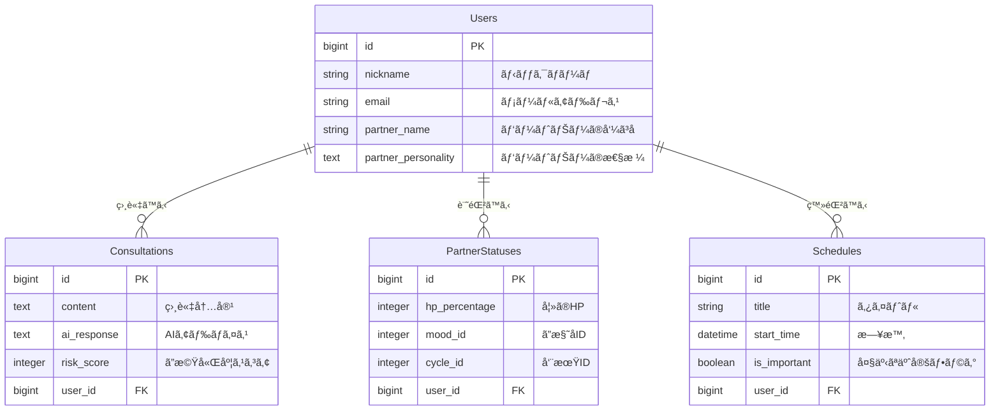
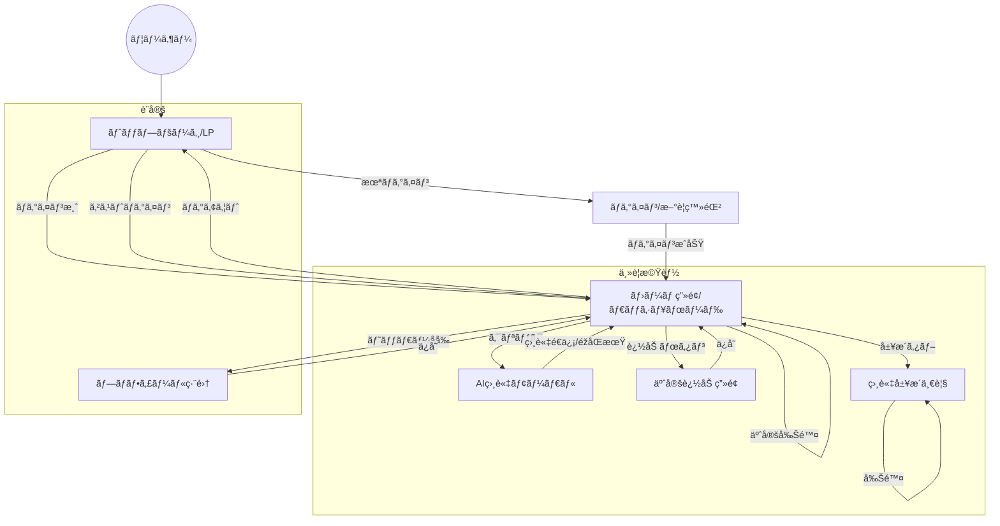

# Meoto-Log（メオトログ）

## 1. アプリケーション概è¦
「妻ã®æ©Ÿå«Œã‚’è«–ç†çš„ã«æ”»ç•¥ã—ãŸã„ã€å¤«ã®ãŸã‚ã®ã€å¤«å©¦ä»²æ”¹å–„・客観視アプリ。
日々ã®è¨€å‹•ã«å¯¾ã™ã‚‹AIã‹ã‚‰ã®å®¢è¦³çš„ãªãƒ•ã‚£ãƒ¼ãƒ‰ãƒãƒƒã‚¯ï¼ˆã”機嫌度採点）ã¨ã€å¦»ã®ã‚³ãƒ³ãƒ‡ã‚£ã‚·ãƒ§ãƒ³ã®å¯è¦–化ã«ã‚ˆã‚Šã€å¿™ã—ã„育å…中ãªã©ã§ã‚‚ã™ã‚Œé•ã„を防ãŽã€å††æº€ãªå®¶åº­ã‚’維æŒã—ã¾ã™ã€‚

## 2. 作æˆã—ãŸèƒŒæ™¯
第一å­èª•ç”Ÿã‚’å‰ã«ã€è‡ªåˆ†è‡ªèº«ã®å¦»ã¸ã®ç†è§£ä¸è¶³ã‚„ã€ç’°å¢ƒå¤‰åŒ–ã«ã‚ˆã‚‹å¤«å©¦ä»²æ‚ªåŒ–ã®ãƒªã‚¹ã‚¯ã‚’痛感ã—ã¾ã—ãŸã€‚
「良ã‹ã‚Œã¨æ€ã£ã¦ã‚„ã£ãŸã“ã¨ã§å¦»ã‚’怒らã›ã¦ã—ã¾ã†ã€ã€Œä½•ãŒæ‚ªã„ã®ã‹è‡ªåˆ†ã§ã¯æ°—ã¥ã‘ãªã„ã€ã¨ã„ã†èª²é¡Œã«å¯¾ã—ã€å€‹äººã®æ„識改é©ã ã‘ã§ãªãã€AIã¨ã„ã†ã€Œæœ‰èƒ½ãªç¬¬ä¸‰è€…ã€ã®è¦–点をå–り入れるã“ã¨ã§ã€è«–ç†çš„ã‹ã¤ç¶™ç¶šçš„ã«é–¢ä¿‚を改善ã—ãŸã„ã¨è€ƒãˆã€é–‹ç™ºã«è‡³ã‚Šã¾ã—ãŸã€‚

## 3. URL
[https://meoto-log.onrender.com]

**※Basicèªè¨¼ã‚’å°Žå…¥ã—ã¦ã„ã¾ã™**
- **ID:** meoto
- **Pass:** 1122

（ゲストログイン機能ãŒã‚ã‚‹ãŸã‚ã€ä¸Šè¨˜å…¥åŠ›å¾Œã¯ã€Œã‚²ã‚¹ãƒˆãƒ­ã‚°ã‚¤ãƒ³ã€ãƒœã‚¿ãƒ³ã‹ã‚‰ã™ãã«è©¦ç”¨å¯èƒ½ã§ã™ï¼‰

## 4. 主ãªæ©Ÿèƒ½
### 🤖 AI相談機能（心臓部）

- **LINE風ãƒãƒ£ãƒƒãƒˆUI**: ã„ã¤ã§ã‚‚ã©ã“ã§ã‚‚ã€ãƒœãƒˆãƒ ãƒŠãƒ“ã‹ã‚‰å³åº§ã«AIã«ç›¸è«‡å¯èƒ½ã€‚
- **ã”機嫌度スコアリング**: 今ã®çŠ¶æ³ã§å¦»ã®æ©Ÿå«ŒãŒã©ã†ãªã®ã‹ã€0〜100点ã§æŽ¡ç‚¹ã€‚
- **パートナー性格設定**: 「ã›ã£ã‹ã¡ã€ã€Œå…±æ„Ÿé‡è¦–ã€ãªã©ã€ãƒ‘ートナーã®æ€§æ ¼ã‚’登録ã™ã‚‹ã“ã¨ã§ã€AIã®ã‚¢ãƒ‰ãƒã‚¤ã‚¹ãŒãƒ‘ーソナライズã•ã‚Œã¾ã™ã€‚
- **体調周期ã®è€ƒæ…®**: 「イライラ期ã€ã€Œã‚­ãƒ©ã‚­ãƒ©æœŸã€ãªã©ã®ä½“調リズムを記録å¯èƒ½ã€‚AI相談時ã«ã“ã®æƒ…å ±ãŒè‡ªå‹•ã§è€ƒæ…®ã•ã‚Œã€ã€Œä»Šã¯ç”Ÿç†å‰ã ã‹ã‚‰å…±æ„Ÿã‚’é‡è¦–ã—ã¾ã—ょã†ã€ã¨ã„ã£ãŸã€ã‚ˆã‚ŠçŠ¶æ³ã«å³ã—ãŸã‚¢ãƒ‰ãƒã‚¤ã‚¹ãŒç”Ÿæˆã•ã‚Œã¾ã™ã€‚

### 📊 ダッシュボード（ホーム画é¢ï¼‰

- **妻ã®HPå¯è¦–化**: ç¾åœ¨ã®ä½“力を数値化ã—ã€ã²ã¨ç›®ã§ã‚³ãƒ³ãƒ‡ã‚£ã‚·ãƒ§ãƒ³ã‚’判断。
- **予定管ç†**: 「ã“ã‚Œã‹ã‚‰ã®äºˆå®šã€ã¨ã€Œå¤§äº‹ãªæ—¥ï¼ˆè¨˜å¿µæ—¥ãªã©ï¼‰ã€ã‚’分ã‘ã¦è¡¨ç¤ºã—ã€ã†ã£ã‹ã‚Šå¿˜ã‚Œã‚’防止。
- **直近ログ**: 相談ã—ãŸçµæžœã‚’ホーム画é¢ã§å³åº§ã«ç¢ºèªå¯èƒ½ã€‚

### 📠ログ管ç†
- **アコーディオンUI**: éŽåŽ»ã®ç›¸è«‡å±¥æ­´ã‚’一覧表示ã—ã€ã‚¿ãƒƒãƒ—ã§è©³ç´°ã‚’展開。
- **フィルタリング**: スコアã«å¿œã˜ã¦è‰²åˆ†ã‘（é’：良好ã€èµ¤ï¼šå±é™ºï¼‰ã•ã‚Œã€ç›´æ„Ÿçš„ã«æŒ¯ã‚Šè¿”ã‚ŠãŒå¯èƒ½ã€‚

### âš¡ï¸ ãƒ¦ãƒ¼ã‚¶ãƒ¼ä½“é¨“ï¼ˆUX）å‘上
- **ゲストログイン機能**: メールアドレス登録ãªã—ã§ã€ãƒ¯ãƒ³ã‚¯ãƒªãƒƒã‚¯ã§å³åº§ã«ã‚¢ãƒ—リã®å…¨æ©Ÿèƒ½ã‚’試用å¯èƒ½ã€‚
  （※試用ã—ã‚„ã™ãã™ã‚‹ãŸã‚ã€ã‚²ã‚¹ãƒˆãƒ­ã‚°ã‚¤ãƒ³ã‚’ã™ã‚‹ãŸã³ã«ãƒ‡ãƒ¼ã‚¿ã¯åˆæœŸçŠ¶æ…‹ã«ãƒªã‚»ãƒƒãƒˆã•ã‚Œã¾ã™ï¼‰
- **レスãƒãƒ³ã‚·ãƒ–対応**: スマートフォンã§ã®æ“作ã«æœ€é©åŒ–ã—ã€ã‚¢ãƒ—リライクãªUIを実ç¾ã€‚
- **PWA対応**: ホーム画é¢ã«ã‚¢ã‚¤ã‚³ãƒ³ã‚’追加å¯èƒ½ï¼ˆiOS/Android）。

## 5. 工夫ã—ãŸãƒã‚¤ãƒ³ãƒˆï¼ˆã“ã ã‚ã‚Šã®UX/機能）

### 🔋 リアリティã®ã‚る「体力（HP）ã€è‡ªå‹•ç®—出ロジック
「妻ã®æ©Ÿå«Œã€ã ã‘ã§ãªã「体力ã€ã‚„「体調周期ã€ã‚‚å¯è¦–化ã™ã‚‹ãŸã‚ã«ã€ç‹¬è‡ªã®è¨ˆç®—ロジックを実装ã—ã¾ã—ãŸã€‚
å˜ç´”ãªAI判定ã ã‘ã§ãªãã€**「人間ã®ç”Ÿæ´»ãƒªã‚ºãƒ ï¼ˆèµ·åºŠã€œå°±å¯ï¼‰ã€** を考慮ã—ãŸæ¸›ç®—ロジックを組ã¿åˆã‚ã›ã‚‹ã“ã¨ã§ã€ã‚ˆã‚Šå®Ÿæ…‹ã«è¿‘ã„数値を自動算出ã—ã¦ã„ã¾ã™ã€‚
- **周期連æº:** 生ç†å‘¨æœŸãªã©ã®ä½“調リズムを記録å¯èƒ½ã«ã—ã€AIãŒãã®ã‚³ãƒ³ãƒ†ã‚­ã‚¹ãƒˆï¼ˆæ–‡è„ˆï¼‰ã‚’ç†è§£ã—ãŸä¸Šã§ã‚¢ãƒ‰ãƒã‚¤ã‚¹ã‚’è¡Œã†ã‚ˆã†ãƒ—ロンプトエンジニアリングを行ã„ã¾ã—ãŸã€‚
- **時間経éŽ:** æœ7時をピークã«ã€å¤œã«ã‹ã‘ã¦å¾ã€…ã«ä½“力ãŒæ¸›å°‘ã™ã‚‹ãƒ­ã‚¸ãƒƒã‚¯ï¼ˆæ·±å¤œå¸¯ã¯ç–²åŠ´çŠ¶æ…‹ã‚’維æŒï¼‰ã€‚
- **AI補正:** 相談内容ã‹ã‚‰åˆ¤å®šã•ã‚ŒãŸã€Œã”機嫌度ã€ã«å¿œã˜ã¦ã€ä½“力ãŒå›žå¾©ã—ãŸã‚Šæ¶ˆè€—ã—ãŸã‚Šã™ã‚‹å¤‰å‹•å‡¦ç†ã€‚

### 🔄 ストレスフリーãªéžåŒæœŸæ›´æ–°
AIã¸ã®ç›¸è«‡å¾Œã€ãƒšãƒ¼ã‚¸ã‚’リロードã™ã‚‹ã“ã¨ãªã**JavaScriptã§å³åº§ã«ç”»é¢ï¼ˆHPメーターやログ）を書ãæ›ãˆã‚‹**処ç†ã‚’実装ã—ã¾ã—ãŸã€‚
ã¾ãŸã€ãƒ¦ãƒ¼ã‚¶ãƒ¼ãŒAIã®ã‚¢ãƒ‰ãƒã‚¤ã‚¹ã‚’ゆã£ãり読ã‚るよã†ã€**「モーダルを閉ã˜ãŸã‚¿ã‚¤ãƒŸãƒ³ã‚°ã€**ã§ç”»é¢ã‚’æ›´æ–°ã™ã‚‹ãªã©ã€åˆ©ç”¨ä½“験（UX）をæãªã‚ãªã„挙動ã«ã“ã ã‚ã‚Šã¾ã—ãŸã€‚

### 🤠åˆè¦‹ãƒ¦ãƒ¼ã‚¶ãƒ¼ã¸ã®é…慮（ゲスト機能ã®å¼·åŒ–）
ãƒãƒ¼ãƒˆãƒ•ã‚©ãƒªã‚ªã¨ã—ã¦ã‚¹ãƒ ãƒ¼ã‚ºã«è©¦ç”¨ã„ãŸã ã‘るよã†ã€ã‚²ã‚¹ãƒˆãƒ­ã‚°ã‚¤ãƒ³æ©Ÿèƒ½ã‚’強化ã—ã¾ã—ãŸã€‚
- **データã®ãƒªã‚»ãƒƒãƒˆ:** ログインã™ã‚‹ãŸã³ã«å°‚用ã®ã‚¢ã‚«ã‚¦ãƒ³ãƒˆã‚’発行ã™ã‚‹ãŸã‚ã€ä»–ã®é–²è¦§è€…ã®ãƒ‡ãƒ¼ã‚¿ã¨ç«¶åˆã—ã¾ã›ã‚“。
- **åˆå›žãƒ‡ãƒ¼ã‚¿ã®ãƒãƒ³ãƒ‰ãƒªãƒ³ã‚°:** データãŒä½•ã‚‚ãªã„åˆå›žç›¸è«‡æ™‚ã®ã¿ã€ç”»é¢ã‚’リロードã—ã¦è¡¨ç¤ºæž ã‚’生æˆã™ã‚‹ãªã©ã€ã‚¨ãƒƒã‚¸ã‚±ãƒ¼ã‚¹ï¼ˆä¾‹å¤–çš„ãªçŠ¶æ³ï¼‰ã«ã‚‚対応ã—ã¦ã„ã¾ã™ã€‚
  
### 🚪 未ログインユーザーå‘ã‘ã®LP（ランディングページ）実装
ログアウト状態ã®ãƒˆãƒƒãƒ—ページをã€å˜ãªã‚‹ãƒ­ã‚°ã‚¤ãƒ³ãƒ•ã‚©ãƒ¼ãƒ ã§ã¯ãªãã€ã‚¢ãƒ—リã®ä¾¡å€¤ã‚’ä¼ãˆã‚‹LPã¨ã—ã¦ãƒ‡ã‚¶ã‚¤ãƒ³ã—ã¾ã—ãŸã€‚
- **機能ã®å¯è¦–化:** アイコンã¨ãƒ†ã‚­ã‚¹ãƒˆã§ä¸»è¦æ©Ÿèƒ½ã‚’分ã‹ã‚Šã‚„ã™ã紹介。
- **スムーズãªèª˜å°Ž:** 「ゲストログインã€ãƒœã‚¿ãƒ³ã‚’最優先ã§é…ç½®ã—ã€åˆè¦‹ã®ãƒ¦ãƒ¼ã‚¶ãƒ¼ã§ã‚‚è¿·ã‚ãšä½“験を開始ã§ãã‚‹UI/UXを実ç¾ã—ã¾ã—ãŸã€‚

## 6. 使用技術
- **Backend**: Ruby 3.2 / Ruby on Rails 7.0
- **Frontend**: HTML / CSS (Tailwind CSS) / JavaScript (Stimulus)
- **Database**: PostgreSQL
- **Infrastructure**: Render
- **API**: OpenAI API (gpt-3.5-turbo / gpt-4o-mini)
- **Tools**: Docker / Git / GitHub

## 7. データベース設計
### Users テーブル
ユーザー（夫）ã®æƒ…報を管ç†ã€‚パートナーã®æ€§æ ¼ã‚„呼ã³åã‚‚ä¿å­˜ã€‚
| Column              | Type   | Options     | Note                               |
| ------------------- | ------ | ----------- | ---------------------------------- |
| nickname            | string | null: false | ニックãƒãƒ¼ãƒ                        |
| email               | string | null: false | メールアドレス                     |
| password            | string | null: false | パスワード                         |
| partner_name        | string |             | パートナーã®å‘¼ã³å                 |
| partner_personality | text   |             | パートナーã®æ€§æ ¼ï¼ˆAIプロンプト用） |

### Consultations テーブル
AIã¸ã®ç›¸è«‡å†…容ã¨ãƒ•ã‚£ãƒ¼ãƒ‰ãƒãƒƒã‚¯ã‚’ä¿å­˜ã€‚
| Column      | Type       | Options     | Note               |
| ----------- | ---------- | ----------- | ------------------ |
| content     | text       | null: false | 相談内容           |
| ai_response | text       | null: false | AIã‹ã‚‰ã®ã‚¢ãƒ‰ãƒã‚¤ã‚¹ |
| risk_score  | integer    | null: false | ã”機嫌度スコア     |
| user        | references | null: false | 外部キー           |

### Partner_Statuses テーブル
妻ã®HPã‚„æ©Ÿå«Œã®çŠ¶æ…‹ã‚’記録。
| Column        | Type       | Options     | Note                 |
| ------------- | ---------- | ----------- | -------------------- |
| hp_percentage | integer    | null: false | HP(0-100)            |
| mood_id       | integer    | null: false | ã”様å­ID(ActiveHash) |
| cycle_id      | integer    |             | 周期ID(ActiveHash)   |
| user          | references | null: false | 外部キー             |

### Schedules テーブル
予定を管ç†ã€‚
| Column       | Type       | Options        | Note             |
| ------------ | ---------- | -------------- | ---------------- |
| title        | string     | null: false    | 予定タイトル     |
| start_time   | datetime   | null: false    | 日時             |
| is_important | boolean    | default: false | 大事ãªäºˆå®šãƒ•ãƒ©ã‚° |
| user         | references | null: false    | 外部キー         |

## 8. ER図

```mermaid
erDiagram
    Users ||--o{ Consultations : "相談ã™ã‚‹"
    Users ||--o{ PartnerStatuses : "記録ã™ã‚‹"
    Users ||--o{ Schedules : "登録ã™ã‚‹"

    Users {
        bigint id PK
        string nickname "ニックãƒãƒ¼ãƒ "
        string email "メールアドレス"
        string partner_name "パートナーã®å‘¼ã³å"
        text partner_personality "パートナーã®æ€§æ ¼"
    }

    Consultations {
        bigint id PK
        text content "相談内容"
        text ai_response "AIアドãƒã‚¤ã‚¹"
        integer risk_score "ã”機嫌度スコア"
        bigint user_id FK
    }

    PartnerStatuses {
        bigint id PK
        integer hp_percentage "妻ã®HP"
        integer mood_id "ã”様å­ID"
        integer cycle_id "周期ID"
        bigint user_id FK
    }

    Schedules {
        bigint id PK
        string title "タイトル"
        datetime start_time "日時"
        boolean is_important "大事ãªäºˆå®šãƒ•ãƒ©ã‚°"
        bigint user_id FK
    }
```

## 99 ç”»é¢é·ç§»å›³

```mermaid
graph TD
    User((ユーザー))
    Top[トップページ/LP]
    Login[ログイン/æ–°è¦ç™»éŒ²]
    Home[ホーム画é¢/ダッシュボード]
    Modal[AI相談モーダル]
    Profile[プロフィール編集]
    ScheduleNew[予定追加画é¢]
    History[相談履歴一覧]

    User --> Top
    Top -->|未ログイン| Login
    Login -->|ログインæˆåŠŸ| Home
    Top -->|ログイン済| Home
    Top -->|ゲストログイン| Home

    subgraph MainFunctions [主è¦æ©Ÿèƒ½]
        Home -->|クリック| Modal
        Modal -->|相談é€ä¿¡/éžåŒæœŸ| Home
        Home -->|追加ボタン| ScheduleNew
        ScheduleNew -->|ä¿å­˜| Home
        Home -->|予定削除| Home
        Home -->|履歴タブ| History
        History -->|削除| History
    end

    subgraph Settings [設定]
        Home -->|ヘッダーåå‰| Profile
        Profile -->|ä¿å­˜| Home
        Home -->|ログアウト| Top
    end
```