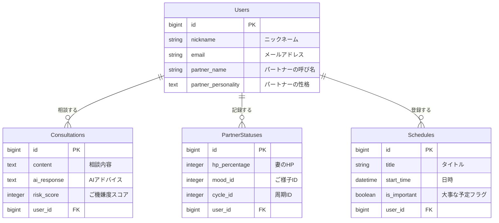

# Meoto-Log（メオトログ）

## 1. アプリケーション概要
「妻の機嫌を論理的に攻略したい」夫のための、夫婦仲改善・客観視アプリ。
日々の言動に対するAIからの客観的なフィードバック（ご機嫌度採点）と、妻のコンディションの可視化により、忙しい育児中などでもすれ違いを防ぎ、円満な家庭を維持します。

## 2. 作成した背景
第一子誕生を前に、自分自身の妻への理解不足や、環境変化による夫婦仲悪化のリスクを痛感しました。
「良かれと思ってやったことで妻を怒らせてしまう」「何が悪いのか自分では気づけない」という課題に対し、個人の意識改革だけでなく、AIという「有能な第三者」の視点を取り入れることで、論理的かつ継続的に関係を改善したいと考え、開発に至りました。

## 3. URL
[https://meoto-log.onrender.com]

**※Basic認証を導入しています**
- **ID:** meoto
- **Pass:** 1122

（ゲストログイン機能があるため、上記入力後は「ゲストログイン」ボタンからすぐに試用可能です）

## 4. 主な機能
### 🤖 AI相談機能（心臓部）

- **LINE風チャットUI**: いつでもどこでも、ボトムナビから即座にAIに相談可能。
- **ご機嫌度スコアリング**: 今の状況で妻の機嫌がどうなのか、0〜100点で採点。
- **パートナー性格設定**: 「せっかち」「共感重視」など、パートナーの性格を登録することで、AIのアドバイスがパーソナライズされます。
- **体調周期の考慮**: 「イライラ期」「キラキラ期」などの体調リズムを記録可能。AI相談時にこの情報が自動で考慮され、「今は生理前だから共感を重視しましょう」といった、より状況に即したアドバイスが生成されます。

### 📊 ダッシュボード（ホーム画面）

- **妻のHP可視化**: 現在の体力を数値化し、ひと目でコンディションを判断。
- **予定管理**: 「これからの予定」と「大事な日（記念日など）」を分けて表示し、うっかり忘れを防止。
- **直近ログ**: 相談した結果をホーム画面で即座に確認可能。

### 📝 ログ管理
- **アコーディオンUI**: 過去の相談履歴を一覧表示し、タップで詳細を展開。
- **フィルタリング**: スコアに応じて色分け（青：良好、赤：危険）され、直感的に振り返りが可能。

### ⚡️ ユーザー体験（UX）向上
- **ゲストログイン機能**: メールアドレス登録なしで、ワンクリックで即座にアプリの全機能を試用可能。
  （※試用しやすくするため、ゲストログインをするたびにデータは初期状態にリセットされます）
- **レスポンシブ対応**: スマートフォンでの操作に最適化し、アプリライクなUIを実現。
- **PWA対応**: ホーム画面にアイコンを追加可能（iOS/Android）。

## 5. 工夫したポイント（こだわりのUX/機能）

### 🔋 リアリティのある「体力（HP）」自動算出ロジック
「妻の機嫌」だけでなく「体力」や「体調周期」も可視化するために、独自の計算ロジックを実装しました。
単純なAI判定だけでなく、**「人間の生活リズム（起床〜就寝）」** を考慮した減算ロジックを組み合わせることで、より実態に近い数値を自動算出しています。
- **周期連携:** 生理周期などの体調リズムを記録可能にし、AIがそのコンテキスト（文脈）を理解した上でアドバイスを行うようプロンプトエンジニアリングを行いました。
- **時間経過:** 朝7時をピークに、夜にかけて徐々に体力が減少するロジック（深夜帯は疲労状態を維持）。
- **AI補正:** 相談内容から判定された「ご機嫌度」に応じて、体力が回復したり消耗したりする変動処理。

### 🔄 ストレスフリーな非同期更新
AIへの相談後、ページをリロードすることなく**JavaScriptで即座に画面（HPメーターやログ）を書き換える**処理を実装しました。
また、ユーザーがAIのアドバイスをゆっくり読めるよう、**「モーダルを閉じたタイミング」**で画面を更新するなど、利用体験（UX）を損なわない挙動にこだわりました。

### 🤝 初見ユーザーへの配慮（ゲスト機能の強化）
ポートフォリオとしてスムーズに試用いただけるよう、ゲストログイン機能を強化しました。
- **データのリセット:** ログインするたびに専用のアカウントを発行するため、他の閲覧者のデータと競合しません。
- **初回データのハンドリング:** データが何もない初回相談時のみ、画面をリロードして表示枠を生成するなど、エッジケース（例外的な状況）にも対応しています。
  
### 🚪 未ログインユーザー向けのLP（ランディングページ）実装
ログアウト状態のトップページを、単なるログインフォームではなく、アプリの価値を伝えるLPとしてデザインしました。
- **機能の可視化:** アイコンとテキストで主要機能を分かりやすく紹介。
- **スムーズな誘導:** 「ゲストログイン」ボタンを最優先で配置し、初見のユーザーでも迷わず体験を開始できるUI/UXを実現しました。

## 6. 使用技術
- **Backend**: Ruby 3.2 / Ruby on Rails 7.0
- **Frontend**: HTML / CSS (Tailwind CSS) / JavaScript (Stimulus)
- **Database**: PostgreSQL
- **Infrastructure**: Render
- **API**: OpenAI API (gpt-3.5-turbo / gpt-4o-mini)
- **Tools**: Docker / Git / GitHub

## 7. データベース設計
### Users テーブル
ユーザー（夫）の情報を管理。パートナーの性格や呼び名も保存。
| Column              | Type   | Options     | Note                               |
| ------------------- | ------ | ----------- | ---------------------------------- |
| nickname            | string | null: false | ニックネーム                       |
| email               | string | null: false | メールアドレス                     |
| password            | string | null: false | パスワード                         |
| partner_name        | string |             | パートナーの呼び名                 |
| partner_personality | text   |             | パートナーの性格（AIプロンプト用） |

### Consultations テーブル
AIへの相談内容とフィードバックを保存。
| Column      | Type       | Options     | Note               |
| ----------- | ---------- | ----------- | ------------------ |
| content     | text       | null: false | 相談内容           |
| ai_response | text       | null: false | AIからのアドバイス |
| risk_score  | integer    | null: false | ご機嫌度スコア     |
| user        | references | null: false | 外部キー           |

### Partner_Statuses テーブル
妻のHPや機嫌の状態を記録。
| Column        | Type       | Options     | Note                 |
| ------------- | ---------- | ----------- | -------------------- |
| hp_percentage | integer    | null: false | HP(0-100)            |
| mood_id       | integer    | null: false | ご様子ID(ActiveHash) |
| cycle_id      | integer    |             | 周期ID(ActiveHash)   |
| user          | references | null: false | 外部キー             |

### Schedules テーブル
予定を管理。
| Column       | Type       | Options        | Note             |
| ------------ | ---------- | -------------- | ---------------- |
| title        | string     | null: false    | 予定タイトル     |
| start_time   | datetime   | null: false    | 日時             |
| is_important | boolean    | default: false | 大事な予定フラグ |
| user         | references | null: false    | 外部キー         |

## 8. ER図

## 99 画面遷移図
